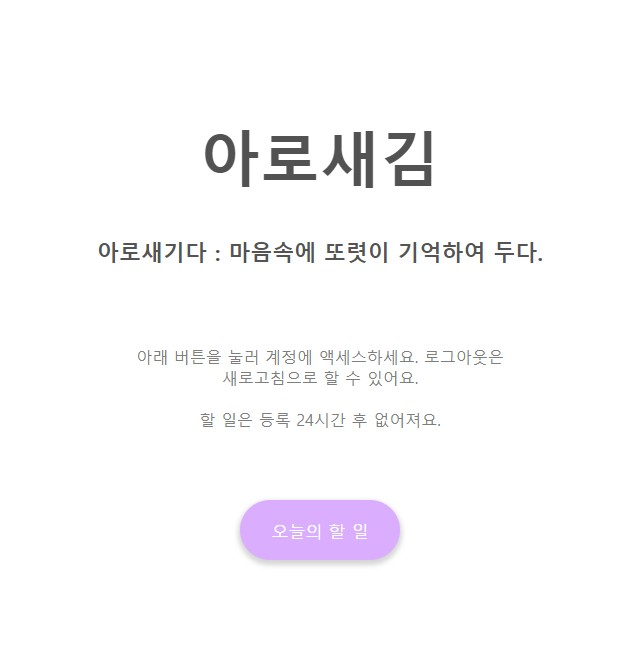
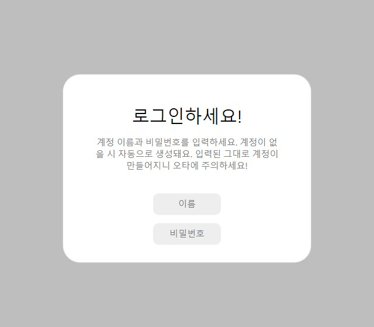
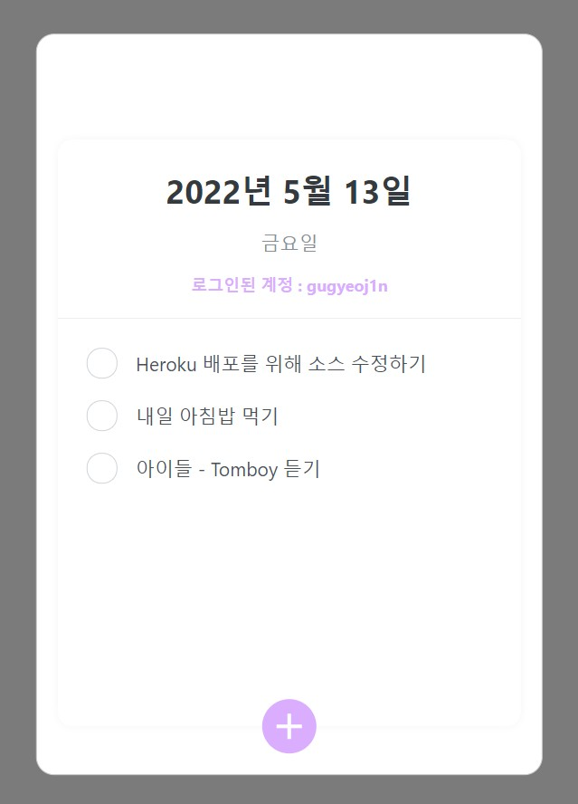

아로새김 : 개인 투두리스트를 기록할 수 있는 웹사이트
=

* * *

> 설명
> ===
> * 클라이언트는 React, 백엔드는 Express와 MongoDB를 사용했다. Heroku로 배포했다.   
   
> 페이지 디자인이다. 이거밖에 없다.   
   
> 로그인할 수 있다. 계정이 없으면 자동으로 생성된다. 아이디나 비밀번호 하나라도 틀리면 다른 계정이 생성돼 버리니 주의!   
   
> 벨로퍼트님의 리액트 강의에서 만든 투두리스트다. 컴포넌트마다 axios를 떡칠해서 할 일 생성, 토글, 삭제 등을 모두 구현했다.   
> 만들면서 느낀 점
> ===
> * 개발 단계에 돌입하기 전에 기획을 확실하게 해 둬야겠다. 대충 이런 걸 만들 거야! 하고 바로 하나하나 만들려니 까먹고 구현하지 않은 기능이 너무 많았다.
> * 풀스택은 굉장히 어렵다.
> * async & await 에 익숙해져야겠다. 클라이언트에서 요청을 보내고 받은 response 속 데이터를 필터링해 화면에 띄우는 컴포넌트가 여러 개 있었는데, response가 오기 전에 최종 return이 실행되는 이슈가 있었다. axios 요청에 await을 달고 이를 실행하는 async 함수를 정의한 뒤 useEffect로 렌더링될 때 응답부터 받아오게 하니 해결됐다.
> * 고작 한 개의 페이지밖에 없는 이 프로젝트 안에 소스 파일이 이렇게나 많이 들어가는구나 싶었다. 코딩으로 이런 결과물을 만들어 본 게 처음인 것 같은데, 과정도 굉장히 재밌었고 뿌듯했다. 확실히 배운 지식은 실전에 써먹어야 의미가 있다.

* * *
근데 배포 중에 에러 나서 빠른 시일 내에 서비스 시작될 예정
